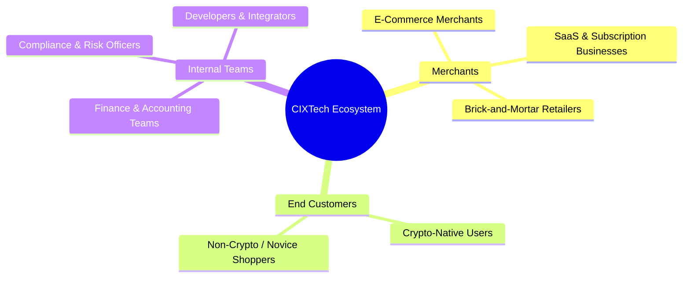
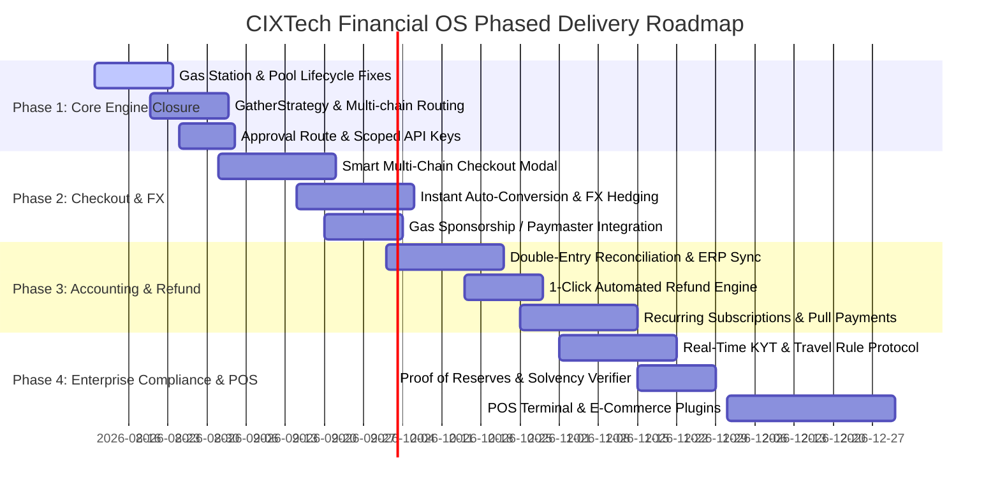

> [!WARNING]
> **Withdrawn — this document describes egofi, not cixtech.**
>
> It recasts the custody engine as a merchant-facing payment product, which
> contradicts the build spec's founding separation ("the engine knows nothing
> about invoices, checkouts or merchants") and non-negotiable principle 7. The
> code written from it was removed; see
> [ADR 0017](adr/0017-engine-scope-boundary.md).
>
> The thinking here is not wrong — it is filed in the wrong repo. Its home is
> egofi, which owns merchants, orders and fiat. Kept for that history only; do
> not build from it here.

---

# Business Requirements Document (BRD)
## Project Name: CIXTech Next-Generation Crypto Payment & Financial Operating System (OS)
**Document Version:** 1.0  
**Date:** August 5, 2026  
**Status:** Approved for Product & Engineering Execution  

---

## 1. Executive Summary

Crypto adoption in global commerce continues to expand rapidly, driven by cross-border settlement speeds, lower baseline processing fees, and financial inclusion—especially across emerging markets in Africa, LATAM, and Southeast Asia. However, despite the promise of decentralization, traditional crypto payment gateways fail to provide the operational, financial, and accounting predictability that merchants demand. 

As documented in `docs/painpoints.md`, traditional gateways solve only the primitive problem of **accepting crypto**, leaving merchants with price volatility risks, opaque fees, manual accounting nightmares, refund "purgatory", chain/wallet confusion, compliance freezes, and poor developer experience.

**CIXTech Financial OS** bridges this gap. By building on CIXTech’s double-entry ledger core (`@cixtech/ledger`), threshold MPC key management (`@cixtech/mpc`), policy engine, and multi-chain architecture, CIXTech will transition from a backend custody engine into a comprehensive **End-to-End Crypto Financial Operating System**. This document defines the business requirements, target market, strategic objectives, success metrics, and high-level scope to transform crypto payments into a seamless, automated experience comparable to Stripe and Paystack.

---

## 2. Problem Statement & Market Pain Points

Merchant research across reviews, forums, and survey data highlights **20 core operational friction points** across six distinct pillars:

| Pillar | Pain Point Summary (`docs/painpoints.md`) | Impact on Merchant Operations |
| :--- | :--- | :--- |
| **1. Volatility & Liquidity** | Hidden spreads (0.5–2.5%+), price slippage between invoice and settlement, delayed payouts, lack of direct fiat/mobile money off-ramps. | Margin erosion, unpredictable revenue, inability to pay local suppliers in fiat currency. |
| **2. Reconciliation & Tax** | No double-entry audit trail, missing invoice-to-deposit matching, lack of QuickBooks/Xero/Odoo export, complex tax/cost-basis calculations. | Dozens of hours lost monthly in manual reconciliation; audit and tax penalty risks. |
| **3. Checkout UX & Abandonment** | Complex wallet connections, gas fee sticker shock, wrong network deposits (e.g. USDT on Tron sent to EVM), non-responsive mobile flows. | High cart abandonment (up to 76%), lost sales, stranded customer funds. |
| **4. Refunds & Disputes** | Manual multi-step refund processes, no chargeback dispute workflow, volatility during refund processing, customer support delays. | Operational "purgatory", 3x longer support tickets, dissatisfied customers. |
| **5. Compliance & Solvency** | Unexpected account freezes, opaque KYB/KYC, lack of real-time KYT address screening (dirty funds), missing Travel Rule & Proof of Reserves (PoR). | Regulatory sanction exposure, frozen banking relationships, counterparty solvency risks. |
| **6. Integration & Features** | Lack of recurring billing/subscriptions, missing POS hardware/QR integration, outdated e-commerce plugins, basic non-actionable dashboards. | Inability to serve SaaS, retail, or enterprise clients; developer frustration. |

---

## 3. Strategic Vision & Business Objectives

### 3.1 Core Value Proposition
CIXTech will empower merchants to **accept crypto from any wallet or chain**, **settle instantly into stablecoins or local fiat/mobile money**, **automate accounting and tax compliance**, and **manage multi-chain treasury** through a single unified API and portal.

### 3.2 Key Business Objectives (KPIs & Target Metrics)
1. **Reduce Checkout Abandonment:** Cut crypto cart abandonment from the industry average of ~76% down to **< 25%** via 1-click chain-agnostic checkout and Paymaster gas sponsorship.
2. **Instant Settlement & FX Protection:** Offer **0% slippage price-guarantee windows** (15-minute locks) and instant settlement to USDC/USDT or local bank/mobile money (e.g., NGN, KES, ZAR, EUR, BRL) within **< 5 minutes**.
3. **Automate 100% of Financial Reconciliation:** Achieve 100% automated double-entry ledger matching with zero manual ledger adjustments for standard transactions, exporting directly to QuickBooks, Xero, and Odoo.
4. **Sub-Minute One-Click Refunds:** Reduce merchant refund resolution time from **days to < 60 seconds** via automated customer refund claims.
5. **Zero-Trust Compliance & Solvency:** Ensure 100% of transactions undergo real-time pre-settlement KYT screening with cryptographically verifiable, real-time Proof of Reserves (PoR) published on-chain/via API.

---

## 4. Target Personas & Stakeholders

1. **E-Commerce Merchants (Shopify, WooCommerce, Magento):** Need turn-key plugins, instant fiat auto-conversion, no gas confusion for buyers, and automated invoice reconciliation.
2. **SaaS & Digital Subscription Providers:** Require recurring automated billing (pull payments), failed payment retries, customer churn analytics, and prorated plan upgrades.
3. **Emerging Market Merchants (Africa, LATAM, SEA):** Require cross-border customer payment acceptance in stablecoins with direct off-ramping into local bank accounts or mobile money (M-Pesa, bank transfers).
4. **Finance & Accounting Operations:** Require double-entry ledger proof, GAAP/IFRS tax reporting exports, cost-basis calculations, and zero manual spreadsheet matching.
5. **Compliance & Risk Officers:** Need real-time address risk scoring (sanctions/mixers), Travel Rule compliance for transactions > $1k, and live Proof-of-Reserves dashboards.

---

## 5. Scope of Business Requirements

### 5.1 In-Scope Capabilities
- **Smart Multi-Chain Checkout:** Supporting EVM (Ethereum, Polygon, Arbitrum, Base, BSC) and Non-EVM (Tron, Solana, Bitcoin) with auto-chain detection.
- **Paymaster & Gas Sponsorship Engine:** Sponsoring network fees or subtracting gas transparently from transaction total.
- **Instant Auto-Conversion & FX Hedging:** Automated conversion to stablecoins (USDC/USDT) or fiat off-ramping.
- **Automated Double-Entry Reconciliation:** Built on `@cixtech/ledger` with native export to QuickBooks, Xero, and Odoo.
- **Automated Refund & Dispute Engine:** One-click merchant refund trigger with customer wallet confirmation portal.
- **Automated KYT, Sanctions Screening & Travel Rule:** Real-time screening prior to ledger crediting + IVMS101 protocol support.
- **Proof of Reserves (PoR):** Automated daily cryptographic solvency verifier ($\sum \text{Ledger Liabilities} \le \sum \text{On-Chain Vault Assets}$).
- **Recurring Crypto Subscriptions:** Smart contract pull-payments and scheduled billing notifications.
- **Point-of-Sale (POS) Terminal & E-Commerce Plugins:** Web/Mobile POS UI for dynamic QR generation + Shopify/WooCommerce plugins.

### 5.2 Out-of-Scope (Phase 1)
- Direct fiat credit card acquiring (Visa/Mastercard card processing in-house—will rely on third-party off-ramp partners).
- Speculative crypto trading or leverage/margin products.

---

## 6. Business Regulatory & Compliance Requirements

1. **KYB / KYC Tiered Onboarding:** Tier 1 (Up to $10k/mo: basic business verification), Tier 2 (Unlimited: full corporate verification, UBO identification).
2. **KYT / Transaction Screening:** Automated integration with Chainalysis/TRM API. Any transaction interacting with OFAC-sanctioned wallets, darknet markets, or mixers must be quarantined immediately to an isolation account (`ACCOUNT_TYPE_QUARANTINE`).
3. **Travel Rule (IVMS 101 Standard):** For any cross-border transfer exceeding $1,000 equivalent, the gateway must collect and securely transmit originator and beneficiary information to counterparty VASPs.
4. **Solvency & Licensing:** System must enforce `@cixtech/ledger` solvency invariant ($\sum \text{Assets} \ge \sum \text{Liabilities}$) at all times and publish daily Proof of Reserves.

---

## 7. Business Risk & Mitigation Strategy

| Business Risk | Severity | Mitigation Strategy |
| :--- | :--- | :--- |
| **Crypto Price Slippage During Invoice Window** | High | Enforce 15-minute locked exchange rates backed by automated LP/DEX hedging orders executed upon invoice creation. |
| **Wrong Network / Stranded Token Deposits** | High | Implement automated multi-chain ingestor token detection; provide a self-service customer recovery portal with auto-sweep logic. |
| **Banking Partner De-platforming / Off-ramp Delays** | High | Integrate multiple redundant fiat & mobile money off-ramp aggregators across key target regions. |
| **Dirty Funds / Regulatory Enforcement** | High | Mandatory pre-credit KYT screening; zero-tolerance automated freeze for sanctioned addresses into segregated ledger accounts. |
| **EVM ERC-20 Gather Stalling (Gas Shortage)** | High | Wire `GasStation` into payout/gather flows to auto-fund native gas tokens before broadcast (`evm-broadcaster.ts`). |

---

## 8. High-Level Phased Implementation Roadmap

---

## 9. Sign-off & Approvals

| Role | Name | Title | Date | Signature |
| :--- | :--- | :--- | :--- | :--- |
| **Executive Sponsor** | Product Steering Committee | CIXTech Leadership | 2026-08-05 | *Approved* |
| **VP of Product** | Head of Crypto Solutions | Product Management | 2026-08-05 | *Approved* |
| **Lead Architect** | Principal Engineer | Core Infrastructure | 2026-08-05 | *Approved* |
