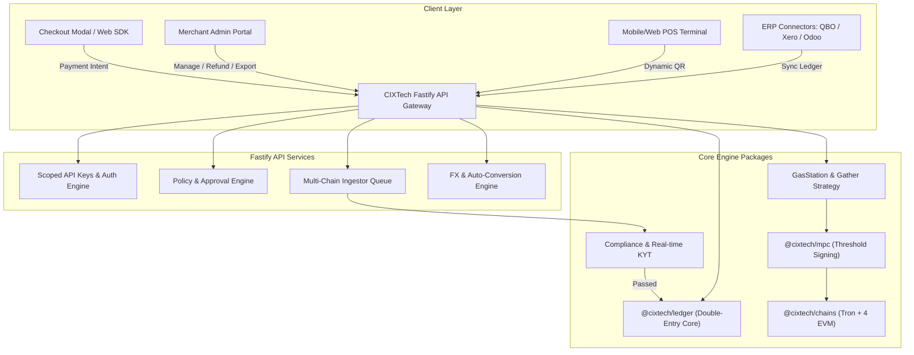

# Product Requirements Document (PRD)
## Project Name: CIXTech End-to-End Crypto Financial Operating System (OS)
**Document Version:** 1.0  
**Date:** August 5, 2026  
**Status:** Ready for Engineering Sprint Planning  

---

## 1. Product Overview & System Architecture

### 1.1 Vision
The CIXTech Financial OS is an end-to-end payment acceptance, settlement, accounting, compliance, and treasury platform designed to make crypto payments as reliable, predictable, and simple as fiat credit card processing. It bridges the Gap between public blockchains and enterprise accounting standard tools.

### 1.2 Platform Architectural Integration



---

## 2. Core Engine Technical Prerequisites (Closing Baseline Gaps)

Before delivering higher-level gateway surface area, the underlying custody engine must resolve the 4 core architectural debt findings detailed in `.whereweare`:

| Feature ID | Engine Gap | Technical Specification | Acceptance Criteria |
| :--- | :--- | :--- | :--- |
| **ENG-01** | EVM ERC-20 Gas Station Unwired | Wire `GasStation` into `evm-broadcaster.ts`. EVM ERC-20 gather & payout transactions must verify gas balance on pool address; if insufficient, dispatch native token transfer from Treasury/Gas pool prior to signing ERC-20 transfer. | 100% of EVM ERC-20 gather transactions execute successfully without native gas insufficiency errors. |
| **ENG-02** | GatherStrategy Port Missing | Add `gather_strategy` column to pool database. Implement `GatherStrategy` port with `EOA_FUND_TRANSFER` strategy tag assigned per-address prior to address minting (ADR 0011). | No deposit address is minted without a valid assigned `GatherStrategy`. |
| **ENG-03** | Pool Lifecycle Stalls at `IN_USE` | Implement pool cooling lifecycle background worker (`apps/worker`). Call `cool()` upon block finality confirmation and `releaseCooled()` on a 60-second timer to return addresses to `AVAILABLE`. | Deposit pool addresses cycle back from `IN_USE` $\rightarrow$ `COOLED` $\rightarrow$ `AVAILABLE`, keeping total address pool bounded. |
| **ENG-04** | Withdrawal Approvals Black Hole & Scoped Keys | Implement `POST /v1/withdrawals/{id}/approve` endpoint. Add `scope` column to `api_key` (`read`, `move-funds`, `approve`). Require distinct keys with `approve` scope for dual control. | High-value payouts entering `REQUIRE_APPROVAL` state can be explicitly approved by authorized API keys. |

---

## 3. Product Feature Specifications (Mapped to Pain Points)

### Pillar 1: Smart Checkout, Chain Routing & Gas Sponsorship (PP 2, 4, 5, 8, 19)

#### Feature 3.1.1: Chain-Agnostic Smart Checkout Modal (`@cixtech/checkout`)
- **Description:** An embeddable React/JS widget and Hosted Payment Page that accepts payments across Tron, EVM (Ethereum, Polygon, Arbitrum, Base, BSC), and Solana.
- **Auto Chain & Token Detection:** Automatically connects to user's injected wallet (MetaMask, Phantom, TronLink, WalletConnect v2) and suggests the chain with the lowest network gas fee.
- **Paymaster Gas Sponsorship:** Supports ERC-4337 paymaster logic where merchant can sponsor customer gas fees, or seamlessly add network fees into the checkout sum in standard fiat currency.
- **Wrong Network / Stranded Token Auto-Detection:** If a customer sends funds on an unexpected chain or token to a pool address:
  - System automatically ingests the unallocated transaction.
  - Generates a customer-facing "Recover Stranded Funds" link.
  - Automatically sweeps funds back to user's desired address minus network cost.

---

### Pillar 2: Price Volatility, FX Protection & Fiat Off-ramping (PP 1, 3, 9, 15)

#### Feature 3.2.1: 15-Minute Guaranteed Price Lock & FX Hedging Engine
- **Description:** Eliminates merchant price volatility risk during checkout.
- **Mechanism:**
  - Upon invoice creation, CIXTech API fetches real-time aggregate exchange rate and locks price for 15 minutes.
  - System executes an automated micro-hedge on a partner DEX/CEX liquidity pool.
  - Even if market drops 10% during checkout, merchant receives 100% of agreed fiat/stablecoin invoice amount.

#### Feature 3.2.2: Automated Fiat & Mobile Money Off-Ramping
- **Description:** Automatic conversion of incoming crypto payments to local fiat currency.
- **Supported Off-ramp Channels:**
  - Direct local bank payout (ACH, SEPA, NGN NIBSS, BRL PIX).
  - Mobile Money Payouts (M-Pesa, Orange Money, MTN MoMo).
- **Settlement Schedule:** Real-time instant off-ramp or scheduled daily batch payout.

---

### Pillar 3: Double-Entry Accounting, Reconciliation & ERP Sync (PP 2, 7, 10, 18)

#### Feature 3.3.1: `@cixtech/ledger` Invoice & Deposit Matching
- **Description:** Leverages `@cixtech/ledger` pure double-entry core to maintain atomic accounting entries for all transaction steps.
- **Ledger Posting Taxonomy:**

```
Posting Flow for $100 Payment:
1. Customer Deposit Received:
   DEBIT  Asset:Custody:Tron:USDT           $100.00
   CREDIT Liability:Merchant:Unsettled      $100.00

2. Fee Deduction & Auto-Conversion:
   DEBIT  Liability:Merchant:Unsettled      $100.00
   CREDIT Revenue:Platform:ProcessingFee     $  1.50
   CREDIT Asset:Custody:Stablecoin:USDC     $ 98.50

3. Payout to Merchant Fiat Account:
   DEBIT  Liability:Merchant:Settled         $ 98.50
   CREDIT Asset:Bank:Fiat:NGN                $ 98.50
```

#### Feature 3.3.2: Turnkey ERP Sync (QuickBooks, Xero, Odoo)
- **Description:** Native connectors that automatically push double-entry journal entries, invoices, fee line-items, and payment statuses directly to QuickBooks Online, Xero, and Odoo.
- **Tax Export:** Generates CSV/JSON reports formatted for TaxBit and CoinTracker with FIFO cost basis calculations and VAT/GST breakdowns.

---

### Pillar 4: One-Click Automated Refunds & Subscriptions (PP 6, 7, 13)

#### Feature 3.4.1: Sub-Minute Merchant Refund Engine
- **Description:** Solves the crypto "refund purgatory".
- **Workflow:**
  1. Merchant clicks **"Issue Refund"** in CIXTech Admin Portal or triggers `POST /v1/payments/{id}/refund`.
  2. Merchant selects refund basis: **Original Fiat Equivalent** or **Original Crypto Amount**.
  3. System sends an automated cryptographic claim link via email/SMS to customer.
  4. Customer enters payout wallet address or connects wallet and clicks "Confirm Claim".
  5. CIXTech MPC Signer automatically broadcasts refund transaction within < 30 seconds.

#### Feature 3.4.2: Recurring Pull-Payment Subscriptions (EIP-7582 / Smart Contracts)
- **Description:** Automated recurring billing for SaaS and subscription businesses.
- **Capabilities:**
  - Automated recurring debit authorization via non-custodial smart contract allowances or off-chain pre-authorized stablecoin vaults.
  - Automated retry schedule (1d, 3d, 7d) with dunning email notifications.

---

### Pillar 5: Compliance, KYT & Real-Time Proof of Reserves (PP 4, 11, 12, 2026+)

#### Feature 3.5.1: Real-Time Pre-Credit KYT Screening
- **Description:** Integrates Chainalysis / TRM Labs API directly into deposit ingestor queue.
- **Screening Invariant:**
  ```
  IF Transaction_Risk_Score > Threshold (OFAC / Darknet / Mixer):
     ROUTE deposit to ACCOUNT_TYPE_QUARANTINE
     FLAG account in Admin Console for Compliance Review
     DO NOT CREDIT merchant balance
  ELSE:
     POST to `@cixtech/ledger` and credit merchant account
  ```

#### Feature 3.5.2: Cryptographic Proof of Reserves (PoR) Engine
- **Description:** Daily automated solvency verification per ADR 0010.
- **Invariant:** $\sum \text{On-Chain Vault Balances} \ge \sum \text{Ledger Merchant Liabilities}$.
- **Public Verifier API:** Endpoint `GET /v1/proof-of-reserves` providing Merkle tree proof of merchant solvency readable by external auditors.

---

### Pillar 6: Developer Platform, POS Suite & Analytics (PP 16, 17, 20)

#### Feature 3.6.1: High-Reliability Developer Platform & Webhooks
- **Idempotency Engine:** All mutating API endpoints require `Idempotency-Key` header to eliminate duplicate billing.
- **Webhook Queue:** Powered by BullMQ & Redis with exponential backoff retries, signature verification (`X-CIXTech-Signature`), and webhook event playback.
- **SDKs & OpenAPI Docs:** `@cixtech/sdk` in TypeScript, Python, Go; live interactive Scalar documentation.

#### Feature 3.6.2: Mobile & Web Point-of-Sale (POS) Suite
- **Description:** Retail checkout application for physical stores.
- **Features:** Dynamic QR code generation, instant audio confirmation upon block detection, staff access controls (cashier mode), and thermal receipt printing support.

---

## 4. Non-Functional Requirements (NFRs)

1. **Performance & Latency:**
   - Fastify API endpoint response time: `< 50ms` (p95).
   - Deposit detection to ledger posting time: `< 2 seconds` after block inclusion.
2. **Security & Key Custody:**
   - Threshold MPC signing (`@cixtech/mpc`) with no single point of key exposure.
   - Dual control enforcement for high-value payouts via scoped API keys (`scope: approve`).
3. **Availability & Scalability:**
   - 99.99% API uptime SLA.
   - Support for 5,000+ concurrent payment checkouts per second.
4. **Database Architecture:**
   - Upgrade production database from PGlite to enterprise PostgreSQL cluster with connection pooling, read replicas, and Point-in-Time Recovery (PITR).

---

## 5. Summary Matrix: Pain Points vs PRD Features

| Pain Point ID (`docs/painpoints.md`) | PRD Feature Section | Feature Name |
| :--- | :--- | :--- |
| **PP 1: Volatility & Spreads** | Feature 3.2.1 | 15-Min Guaranteed Price Lock & FX Hedging |
| **PP 2: Accounting & Reconciliation** | Feature 3.3.1 & 3.3.2 | `@cixtech/ledger` Sync & QuickBooks/Xero Connectors |
| **PP 3: Slow Settlement** | Feature 3.2.2 | Instant Fiat & Mobile Money Off-Ramping |
| **PP 4: Complex Wallets** | Feature 3.1.1 | Smart Checkout & Paymaster Gas Sponsorship |
| **PP 5: Chain Confusion** | Feature 3.1.1 | Auto-Chain Detection & Stranded Token Recovery |
| **PP 6: Terrible Refunds** | Feature 3.4.1 | Sub-Minute One-Click Customer Refund Link |
| **PP 7: Dispute Handling** | Feature 3.3.1 | Double-Entry Audit Trail & Escrow Holds |
| **PP 8: Checkout Experience** | Feature 3.1.1 | `@cixtech/checkout` Modal & 1-Click Pay |
| **PP 9: Multi-Currency Management** | Feature 3.2.1 | Multi-Chain Unified Treasury Auto-Rebalancing |
| **PP 10: Tax Reporting** | Feature 3.3.2 | Automated FIFO Tax & Cost-Basis Exporter |
| **PP 11: Fraud & Dirty Funds** | Feature 3.5.1 | Real-Time Pre-Credit KYT Screening |
| **PP 12: Compliance Burden** | Feature 3.5.1 & 3.5.2 | Tiered KYB, Travel Rule & Proof of Reserves |
| **PP 13: Subscription Payments** | Feature 3.4.2 | Recurring Pull-Payment Smart Contracts |
| **PP 14: Customer Identity** | Feature 3.6.1 | Customer CRM Profile Mapping in API |
| **PP 15: Cross-Border FX** | Feature 3.2.2 | Emerging Market Mobile Money & Bank Payouts |
| **PP 16: POS Integration** | Feature 3.6.2 | Retail POS Terminal & Dynamic QR Generator |
| **PP 17: ERP & E-Commerce** | Feature 3.3.2 | Turnkey Shopify, WooCommerce & Odoo Plugins |
| **PP 18: Lack of Business Insights** | Feature 3.6.1 | Merchant Analytics Dashboard & Funnel Metrics |
| **PP 19: High Network Fees** | Feature 3.1.1 | Smart Gas Sponsorship & Paymaster Engine |
| **PP 20: Developer Experience** | Feature 3.6.1 | Type-Safe SDKs, Webhooks & Idempotency Keys |
